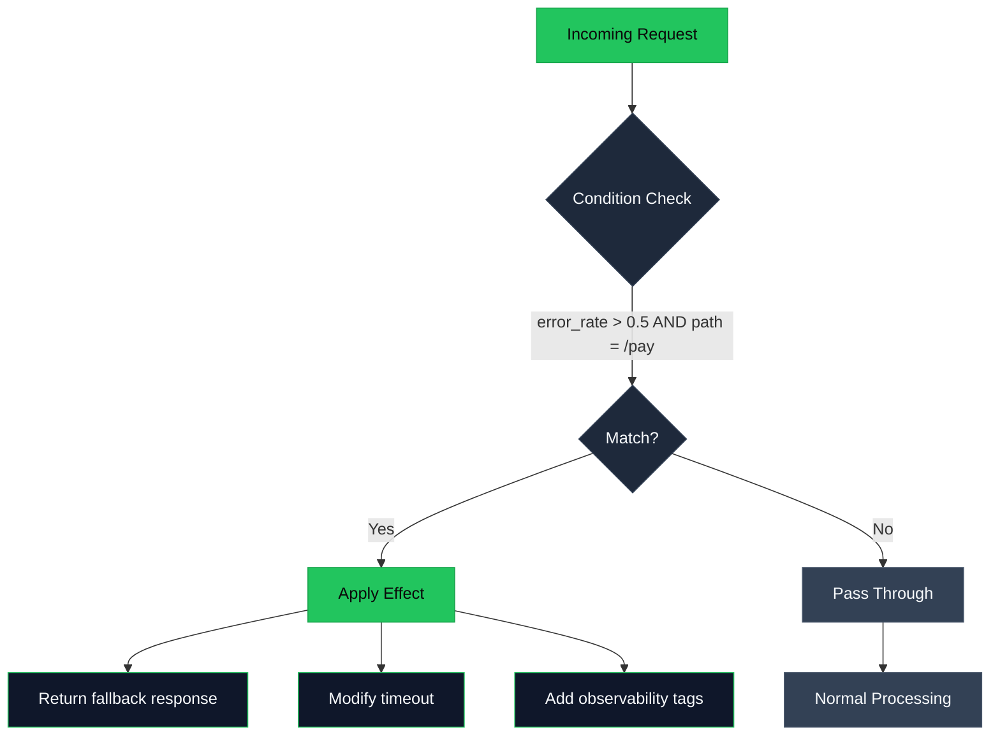

## Architecture

LiveOps separates **when** to intervene from **what** to do:

## Core Principles

**Pure evaluation** — The engine returns decisions, never performs I/O. Your middleware executes the effects.

**Fail-open** — Errors in patch evaluation allow the request through. Never blocks production traffic due to policy bugs.

**Deterministic** — Same input always produces same output. Fully testable before deployment.

## Integration Points

LiveOps embeds as a library with hooks at key points:

- HTTP request/response
- gRPC unary/streaming
- Downstream service calls
- Custom domain-specific hooks

<Card title="Request Early Access" icon="rocket" href="https://calendly.com/saditya9211/30min">
  See a live demo of the architecture in action.
</Card>
